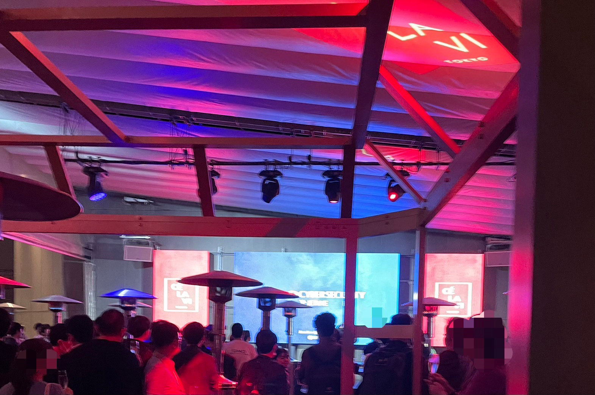

CODE BLUE 2024 に学生スタッフとして参加してきました！

---

## はじめに

こんにちは、IKです。

11/13 ~ 11/15 にCODE BLUE 2024 に学生スタッフとして参加してきました！

CODE BLUE への学生スタッフとしての参加に興味がある方の一助となればと思い、参加記を書いておこうと思います。

[CODE BLUE](https://codeblue.jp/) への参加が初めてであり、その上で学生スタッフということで前日まではかなり緊張していましたが、結果としては、とても楽しい3日間であり、よい経験となりました。

何か本記事に不備などありましたらご連絡ください。

それではよろしくお願いいたします。

---

## 応募文

応募文も気になる方がいるかも知れないと思ったので、一応何を書いたのかを記述しておくと、

- 自分が現在何をしている人なのか（大学の学部やサークルなど）
- 技術的には何をしているのか（私の場合はこのブログやCTFなど）
- アルバイトは何をしているのか
- CODE BLUE 学生スタッフへの応募理由
- CODE BLUE に対しての熱意
- HP、Blog、X などのURL

上記のようなことを書きました。

これが正解ということでは全くもってないと思いますが、採用されたということは熱意ぐらいは伝えることができたのかなと思います。

---

## CODE BLUE Day0（準備日）



まず準備日ですが、

13時に集合して、割り当てられた担当分野の方々との顔合わせや、当日の仕事の手順の確認などを行いました。

私の担当は、コンテスト、ワークショップでした。

CODE BLUE 内の各所で行われるコンテストやワークショップの結果の収集や、出展者様、コンテスト主催者様のサポートを行う担当です。

学生スタッフが6人、コアスタッフの方が2人という体制で準備を進めました。



ホテルはリッチモンドホテルというところでした。

どこにでもあるビジネスホテルという感じでしたが、ドライヤーがPanasonicの風量が強いやつだったのが嬉しかったですね。

明日も早いということで22時前には寝ていました。

---

## CODE BLUE Day1



 5:40 起床、7:00 集合ということで朝は大変でした。

なんとか起床して、7:00に間に合いました。

CODE BLUEの会場がベルサール高田馬場で宿泊場所が目白だったので、ホテルから会場まで山手線で1駅でした。

私の持ち場はここでした。

 

ここは会議室1,2（Biohacking Village 、KCG）側の1階です。

このエスカレーターの下がCODE BLUEの本会場（HALL1 , HALL2）なのですが、ここに立っているとよく「CODE BLUE の会場はどこですか？」と聞かれることが多かったです。

日本の方だけではなく、海外の方から英語で質問されることも多かったですね。

日常会話程度の英語ができるとコミュニケーションが取れて楽しいです。（フィーリングでもなんとかなる）

わからない場合はGoogle翻訳を使っていました。

9:00 ~ 12:00 ぐらいは人通りも程よくあり忙しかったのですが、午後からは少なくなってきたので、HALL2やTrack1の講演などを観に行っていました。

学生スタッフの間でTrack1の講演で聴講したいものをそれぞれ上げて、交代で空き時間を作ってもらい講演を見に行くことができました。

私は講演を2つほど聴講することができました。

Track1の講演は講演者の方が基本的には海外の方なので英語なのですが、同時通訳レシーバーを借りることで日本語で講演を楽しむことができました。

そんなこんなで1日があっという間に過ぎ、18:30に解散しました。

解散した後は、同じコンテスト、ワークショップ担当の方たちとご飯を食べに行きました。

寝たのは23時ぐらいでした。



---

## CODE BLUE Day2



5:40 起床、7:00 集合、２日連続はやはりきますね。



この写真ですが、2日目の早朝に前日の看板を片付ける前に撮ったものです。（2日目にBlueboxはありません...）

基本的には1日目と流れは同じです。

1日目と比べて、コンテストやワークショップはもう軌道に乗っているので1日目と比べて時間に余裕がありました。

来場者の方の対応をしつつ、時間を見てTrack1の講演を聴講しつつ過ごしました。

お昼ごはんはこちらです。（1日目は取り忘れました...）

2日目は18:30から（当日は時間を押していて19:00頃だった）NetworkingPartyが行われました。

お酒なども提供され、立食パーティーのようなかたちで様々な企業の方やSpeakerの方などがいらっしゃいました。

様々な方とお話することができて楽しかったですね。

そんなこんなでCODE BLUE 2024 は閉会となりました。

その後、GMO様が主催するCODE BLUE 24 After Party に参加しました。

参加は任意だったのでホテルに帰る学スタも多かったです。

クラブみたいな感じでした。

ここでも様々な方（普段会わなさそうな方）とお話できて楽しかったです。

景色も良かったです！

終わったのは24時ぐらいだった気がします。

その後、ホテルに帰って、3次会ということで学スタの方たちともんじゃを食べに行きました。



そんなこんなで私の CODE BLUE 2024 学生スタッフとしての3日間は終わりました。

---

## 終わりに



結論から書くと、めちゃくちゃ楽しかったですね。

応募するときに私なんかでいいのかなと思っていたのですが、一歩踏み出してみて良かったです。

迷われている方がもしいましたら、勇気を持って応募してみてください。

後悔はしないと思います！

来年度からも何かしらのかたちで CODE BLUE に関わっていけたらと考えています。

お読みいただきありがとうございました。

---