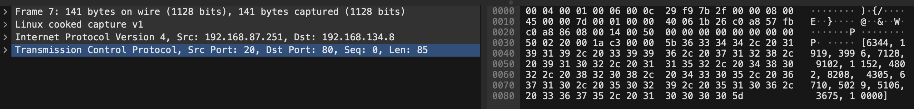
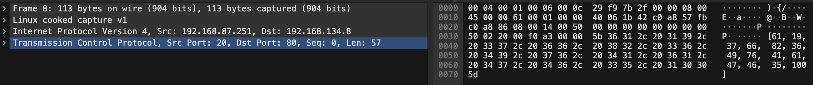

2024年のcorCTFに参加しました。そこで解けた問題のwriteupを書きました。

---

## はじめに

こんにちは、IKです。

自分が学んだことを文書として記録しておこうと考え、記述します。

今回は2024年7月27日にcorCTFに参加したため、そこで解けた問題のwriteupを書いてみようと思います。

結果は641チーム中296位でした。

正直、思っていた以上に難易度が高くてかなり苦戦しました。

公式 HP → [corCTF](https://ctf.cor.team/)

---

## forensics/the-conspiracy


| 問題文 | Our intelligence team created a chat app, and secretly distributed it to the lemonthinker gang. We've given you the application source and a capture taken by one of our agents - can you uncover their plans? |
| --- | -------------------------------------------------------------------------------------------------------------------------------------------------------------------------------------------------------------- |

脆弱性のあるチャットアプリをテロ組織に配布したということですかね。

Pythonで書かれているチャットアプリのソースファイルとパケットキャプチャファイルがダウンロードできます。

- source.py
```python
import random
from scapy.all import *
import csv

sources, destinations, messages = [], [], []

with open('chatlogs.csv', mode='r') as file:
    csv_reader = csv.reader(file)
    for row in csv_reader:
        sources.append(row[0])
        destinations.append(row[1])
        messages.append(row[2])

def encrypt(message):
    messagenums = []
    for character in message:
        messagenums.append(ord(character))
    keys = []
    for i in range(len(messagenums)):
        keys.append(random.randint(10, 100))

    finalmessage = []
    for i in range(len(messagenums)):
        finalmessage.append(messagenums[i] * keys[i])

    return keys, finalmessage

for i in range(len(messages)):
    finalmessage, keys = encrypt(messages[i])
    print(finalmessage, keys)
    packet1 = IP(src=sources[i], dst=destinations[i])/TCP(dport=80)/Raw(load=str(finalmessage))
    send(packet1)
    packet2 = IP(src=sources[i], dst=destinations[i])/TCP(dport=80)/Raw(load=str(keys))
    send(packet2)
```

chatlogs.csvからチャットデータを受け取り、一文字ずつ暗号化していますね。

暗号化方法は単純でランダムな数字（10~100）を文字数分作成し、文字をASCIIコード化した数値と乗算しているだけですね。

その`keys`配列も暗号文と一緒に送信されていますね。

実際のパケットキャプチャが下記です。

- 暗号文のパケット


- keysのパケット


あとは復号するコードを書くだけですね。

- decrypt.py
```python
cipher0 = [6344, 1919, 3996, 7128, 9102, 1152, 4802, 8208, 4305, 6710, 5029, 5106, 3675, 10000]
keys0 = [61, 19, 37, 66, 82, 36, 49, 76, 41, 61, 47, 46, 35, 100]

def decrypt(cipher,keys):
    for i in range(len(cipher)):
        decrypt_code = cipher[i] // keys[i]
        print(chr(decrypt_code),end='')
    print("")

decrypt(cipher0,keys0)
```

全行復号してFlagを得ることができました。

一行ずつペイロードをコピーして復号していったので時間がかかりすぎました...

もっといい方法があったのではないかと思っています。

---

## 終わりに

corCTF 2024 のwriteupを書きました。

来週はCrewCTFがあります。

corCTFよりは善戦できるように頑張ります。

corCTFを開催、運営、作問してくださった皆様ありがとうございました。

最後までお読みいただきありがとうございました。

---