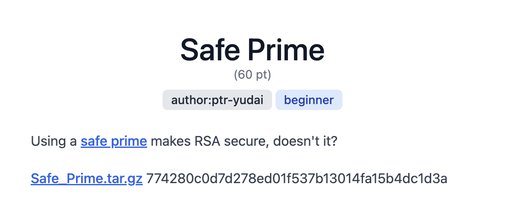
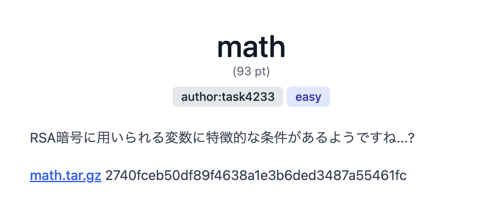

SECCON Beginners CTF 2024 に参加しました。そこで解くことができた問題のwriteupです。



---

## はじめに

こんにちは、IKです。

自分が学んだことを文書として記録しておこうと考え、記述します。

今回は2024/6/15~16にSECCON Beginners CTF 2024に参加したため、そこで解けた問題のwriteupを書いてみようと思います。

結果は962チーム中239位でした。

正直、思っていた以上に難しくてかなり苦戦しました。

ですが、かなり楽しかったです。

公式 X → [SECCON Beginners](https://x.com/ctf4b)

---

## Safe Prime (crypt)



「Using a safe prime makes RSA secure, doesn't it?」ということで、[リンク先](https://en.wikipedia.org/wiki/Safe_and_Sophie_Germain_primes)に飛んでみると、ソフィー・ジェルマン素数についての記事がありました。

ソフィー・ジェルマン素数は2倍して1を加算した値が素数となる素数らしいですね。

なるほど？これを使うのか？

早速、添付されたファイルを解凍してみました。

- output.txt（長過ぎる数値は省略しています）
```txt
n = 2929273674335109489017519020577178006920386912933...
c = 4079147023611080473331281727592132489201992797665...
```

- chall.py（CTF中に加えたコメント付き）
```python
import os
from Crypto.Util.number import getPrime, isPrime


# フラグを生成、バイト列に変換
FLAG = os.getenv("FLAG", "ctf4b{*** REDACTED ***}").encode()
# バイト列をビッグエンディアンで整数に変換
m = int.from_bytes(FLAG, 'big')

# q（素数）を見つけるループ
while True:
    # 512ビットの素数を生成
    p = getPrime(512)
    print(p)
    q = 2 * p + 1
    # 素数かどうか判定
    if isPrime(q):
        break

# 暗号文の生成
n = p * q
e = 65537
c = pow(m, e, n)

# 出力
print(f"{n = }")
print(f"{c = }")
```

RSA暗号なので、n の素因数である p と q を求めることができれば暗号文である c を復号することができそうですね。

コメントを入れつつ、コードを理解していったら、下記の数式で p を求められそうということがわかりました。

$$ p * ( 2 * p + 1 ) = n$$

あとは解くだけですね。

SymPyに解いてもらいました。

- SymPy
```python
import sympy

p = sympy.Symbol('p') 
n = 2929273674335109489017519020577178006920386912933...

equation = p * (2 * p + 1) - n

print(sympy.solve(equation))
```

p を求めることができたので、 c を復号することができます。

- c を復号
```python
import math

e = 65537
n = 2929273674335109489017519020577178006920386912933...
c = 4079147023611080473331281727592132489201992797665...
p = 1210221813209278898307612082766079330277295421282...
q = 2 * p + 1

# 最小公倍数
def lcm(x, y):
    return (x * y) // math.gcd(x, y)

# 拡張ユークリッドの互除法
def extended_gcd(a, b):
    if a == 0:
        return b, 0, 1
    else:
        gcd, x, y = extended_gcd(b % a, a)
        return (gcd, y - (b // a) * x, x)

d = extended_gcd(e,lcm(p-1,q-1))[1]
m = pow(c,d,n)

# 16進数文字列に変換
hex_string = "%0512x" % m 
# 16進数文字列をバイトにデコード
flag = bytes.fromhex(hex_string)
print(flag)
```

Flagを得ることができました。

だいたい、45分ぐらい使いました。

---

## math (crypt)



math ということで数学系の問題でしょうか。

変数に特徴的な条件があるようですね。

添付されたファイルを解凍してみました。

- output.txt（長過ぎる数値は省略しています）
```txt
n = 2834796283188276945461855395495881985131957998448...
e = 65537
cipher = 21584943816198288600051522080026276522658576...
ab = 283479628318827694546185539549588198513195799844...
```

- secret.py
```python
import gmpy2

p = # REDUCTED
q = # REDUCTED
x = # REDUCTED
```

- chal.py（CTF中に加えたコメント付き）
```python
from Crypto.Util.number import bytes_to_long, isPrime
from secret import (
    x,
    p,
    q,
)  # x, p, q are secret values, please derive them from the provided other values.

import gmpy2

# 完全平方かどうかを判定
def is_square(n: int):
    return gmpy2.isqrt(n) ** 2 == n

# assert文は、指定された条件が True であることを確認。
# 条件が False の場合、AssertionError が発生し、プログラムの実行が停止させる。

# p q が素数であるか、同値ではないかをチェック
assert isPrime(p)
assert isPrime(q)
assert p != q

# p q から x を減算し、x a b が完全平方かどうかをチェック
a = p - x
b = q - x
assert is_square(x) and is_square(a) and is_square(b)


n = p * q
e = 65537
# 文字列をバイト列へ
flag = b"ctf4b{dummy_f14g}"
# バイト列を整数へ
mes = bytes_to_long(flag)
c = pow(mes, e, n)

print(f"n = {n}")
print(f"e = {e}")
print(f"cipher = {c}")
print(f"ab = {a * b}")

# clews of factors（要因のねじれ）

# a b が この数値で割った余りが0。
assert gmpy2.mpz(a) % 470171588923907315075499534165620338587636712192141680969062901182658
5737797672332435916637751589158510308840818034029338373257253382781336806660731169 == 0
assert gmpy2.mpz(b) % 357603934780731681205544604394084185179388690004915759719772652414034
59560088076621005967604705616322055977691364792995889012788657592539661 == 0
```

まず、切口を見つけるのに苦労しました。

p q が x 減算されて a b となり a b x は完全平方である。

加えて、a b は特定の数値で割った余りが0という条件がある。

ここで色々考えた結果、下記の式を思いつきました。

$$pq = (a + x)(b + x)$$

この式を変形していくと、切口を見つけることができました。

- 変形
$$ pq = ab + ax + bx + x^2$$

pq = n なので値を与えられています。

また、ab の値も与えられています。

ですので、あとは a と b の値を求めることができれば x を得ることができ、p q を得ることができます。

では、a b の値をどうやって求めるのか...

ここで道を見失いました...

とりあえず寝よ。

朝起きて、顔を洗い、コーヒーを飲み、ぼーーとしていたら、

あれ？

<u>a b は特定の数値で割った余りが0</u>の特定の数値が素数なら a b 求められることね？

もし素数の場合、a b は完全平方であるため、特定の数値が2乗分あることがわかります。

また、ab は a と b の乗算であるため、特定の数値2つの2乗分が素因数であることがわかる。

つまり、4つの素因数がわかる。

4つの巨大な素因数を得ることができれば、abを素因数分解が可能な桁数にすることができるのでは？

早速、確かめてみました。

- 素数かチェック
```python
from Crypto.Util.number import isPrime

roota = 470171588923907315075499534165620338587636712192141...

rootb = 357603934780731681205544604394084185179388690004915...

if isPrime(roota):
    print("yes roota is prime")

if isPrime(rootb):
    print("yes rootb is prime")
```

素数でした。

次に、ab をを素因数で除算してから、素因数分解をしてみました。

- abを素因数分解
```python
import sympy

ab = 28347962831882769454618553954958819851319579...

roota = 47017158892390731507549953416562033858763...

rootb = 35760393478073168120554460439408418517938...

ab = ab // (roota ** 2 * rootb ** 2)

# 素因数分解
factors = sympy.factorint(ab)
print("Factors:", factors)
```

素因数分解をすることができました。

すべて２乗であるため、完全平方である a b 内の素因数であることがわかります。

あとは、a にどの素因数が、b にどの素因数が入っているのかを総当りで調べるだけです。

- a , b の値を調べる
```python
import sympy

num1 = 3**2
num2 = 173**2
num3 = 199**2
num4 = 306606827773**2

roota = 47017158892390731507549953416562033858763...

rootb = 35760393478073168120554460439408418517938...

# ここは総当たりで組み合わせを変えていきました。
a = roota ** 2 * num2 * num4
b = rootb ** 2 * num1 * num3

x = sympy.Symbol('x') 

equation = ab + (a * x) + (b * x) + x**2 - n

print(sympy.solve(equation))
```

全組み合わせを試した結果、唯一、x が整数になる組み合わせを見つけることができました。

あとは、x a b から p q を導き、cipher を復号するだけです。

- cipher を復号
``` python
import math

ab = 2834796283188276945461855395495881985131957998448233...
x = 10221013321700464817330531356688256100
a = 78788245080238253206205524388591317513410112364356613...
b = 35979939397067537902081973781488489498220433097696825...
n = 28347962831882769454618553954958819851319579984482333...
e = 65537
cipher = 215849438161982886000515220800262765226585768981...

p = a + x
q = b + x

# 最小公倍数
def lcm(x, y):
    return (x * y) // math.gcd(x, y)

# 拡張ユークリッドの互除法
def extended_gcd(a, b):
    if a == 0:
        return b, 0, 1
    else:
        gcd, x, y = extended_gcd(b % a, a)
        return (gcd, y - (b // a) * x, x)

d = extended_gcd(e,lcm(p-1,q-1))[1]
m = pow(cipher,d,n)

print(m)

# 16進数文字列に変換
hex_string = "%0512x" % m 
# 16進数文字列をバイトにデコード
flag = bytes.fromhex(hex_string)
print(flag)
```

時間ギリギリでFlagを得ることができました。

これを解けたのはかなり嬉しかったですね。

余談ですが、整数からバイトに変換するコードは`long_to_bytes`使えばよかったですね。

```python
from Crypto.Util.number import long_to_bytes

bytes_data = long_to_bytes(m)
print(bytes_data)
```

あと、`roota`とか`rootb`の変数名にしていますが、正しくない変数名ですね。

反省点も多いです。

---

## 終わりに

SECCON Beginners CTF 2024のwriteupを書きました。

SECCON Beginners CTF 2024を開催、運営、作問してくださった皆様ありがとうございました。

今週末はWaniCTFが控えています。

初心者向けCTFが多くて嬉しいですね。

最後までお読みいただきありがとうございました。

---