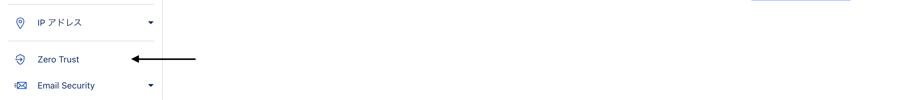
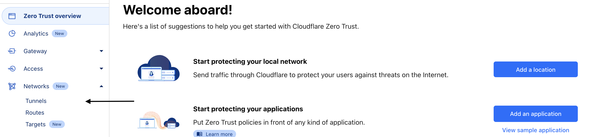
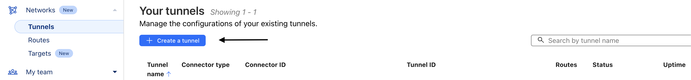
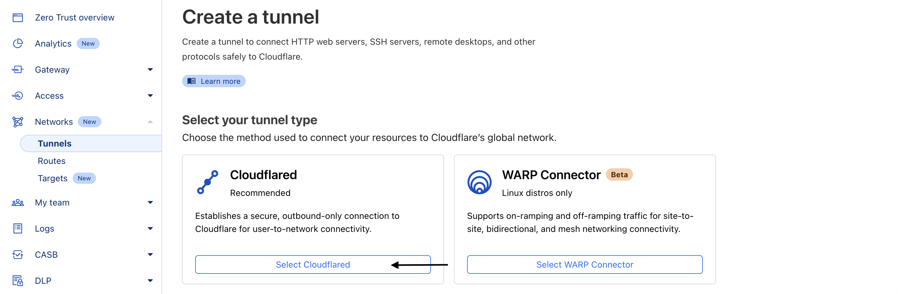
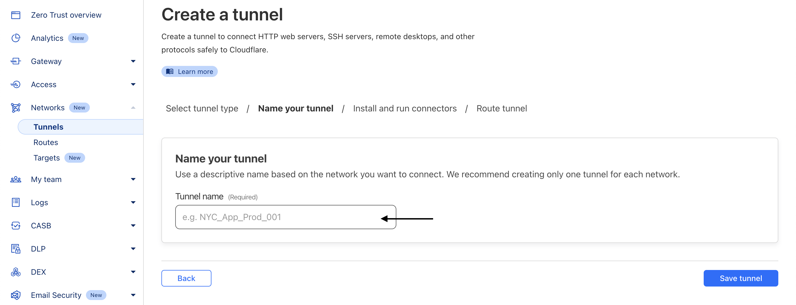
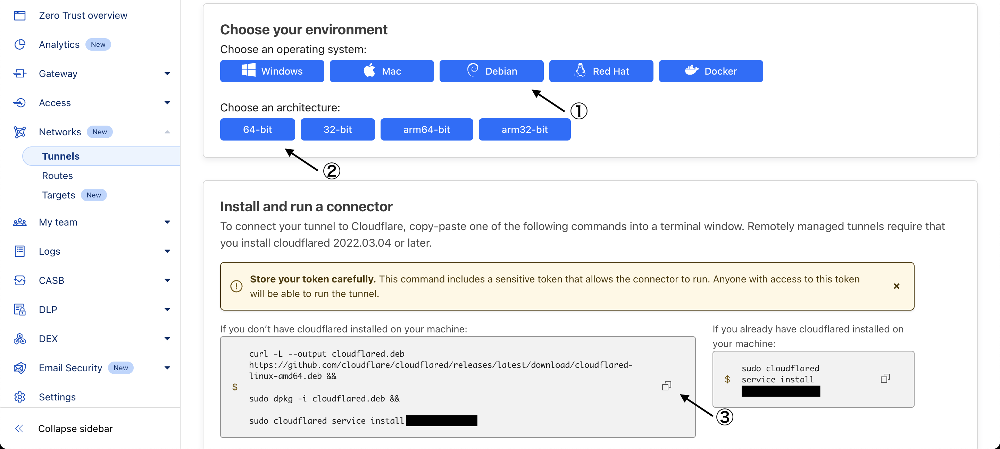

CTFdをAWSのEC2とCoudflareTunnelを使って簡単にHTTPSで公開した手順を紹介します。

---

## はじめに

こんにちは、IKです。<br>

自分が行ったことを文書として記録しておこうと考え、記述します。

今回はCTFdをAWSのEC2とCoudflareTunnelを使って簡単にHTTPSで公開した手順を紹介します。

間違っている点、わかりにくい点などあればご連絡いただけると幸いです。

---

## 前提

下記を前提条件として進めていきます。

1. **Cloudflareで管理しているドメインを所有している**<br>
2. **AWSでEC2インスタンス（Ubuntu）を所有している**


---

## VPC上にCTFdを展開する

まず、VPC上にCTFdを展開していきましょう。

CTFdはdockerでまとまっているのでVPC上で展開する手順は非常に簡単です。

筆者のVPCの環境は下記となります。

```
Distributor ID:	Ubuntu
Description:	Ubuntu 24.04.1 LTS
Release:	    24.04
Codename:	    noble
```


### SSH接続

- SSHに接続
```bash
ssh -i .ssh/<キーペア名>.pem ubuntu@<VPCのIPアドレス>
```

### パッケージの更新

- 最新のパッケージ情報を取得
```bash
sudo apt update
```

- パッケージを更新
```bash
sudo apt upgrade
```

### DockerとGitをインストール

- Dockerをインストール
```bash
sudo apt install docker-compose
```

- Gitをインストール
```bash
sudo apt install git
```

### CTFdをGitHubから取得

- git cloneでCTFdを取得
```bash
git clone https://github.com/CTFd/CTFd.git ctfd
```


## Docker

- cloneしたディレクトリへ移動
```bash
cd ctfd
```

- コンテナを立ち上げる
```bash
sudo docker-compose up -d
```


これで、`http://localhost:8000`でCTFdが公開されていると思います。

---

## CloudflareTunnelの実装

次に、CloudflareTunnelの実装をしていきます。

CloudflareTunnelを実装することで、上記の`http://localhost:8000`で公開されているサーバをHTTPSで外部に公開することができます。

では、まずCloudflareのZeroTrust画面に行きます。

1. **ZeroTrust画面へ**


次に、CloudflareTunnelの画面に行きます。

2. **CloudflareTunnelの画面へ**


では、CloudflareTunnelを作成していきましょう。

下記の`Create a Tunnel`ボタンを押してください。<br>※Tunnelを初めて作成する場合は`Add a Tunnel`ボタンのようなものだった気がします。

3. **Tunnelの作成**


TunnelTypeはCloudflaredを選択します。

4. **TunnelTypeの選択**


Tunnelの名称を決めてください。

5. **Tunnelの名前を設定**


VPC側にCloudflaredをインストールしていきます。

①：OSを選択

②：アーキテクチャを選択

③：作成されたコマンドをコピー

6. **VPCにCloudflaredをインストール**


作成されたコマンドをVPC側のシェルで入力してください。<br>
※余談ですが、このコマンドでは一度きりのインストールとなるため、aptでコントロールしたい場合はapt側でインストールすることを推奨します。

- 作成されたコマンド
```bash
curl -L --output cloudflared.deb https://github.com/cloudflare/cloudflared/releases/latest/download/cloudflared-linux-amd64.deb && 

sudo dpkg -i cloudflared.deb && 

sudo cloudflared service install yourkey
```

最後にサブドメインの設定を行っていきます。

- Public hostnameには公開したいサブドメインを入力してください。

- ServiceにはVPC側で起動しているコンテナのURLを入力してください<br>※今回の場合は`http://localhost:8000`になります。

- 最後に`Save tunnel`を押せば完了です。

7. **サブドメインの設定**
	


これで指定したサブドメインでブラウザからCTFdのコンテナに繋がると思います。

---

## 終わりに


今回はCTFdをAWSのEC2とCoudflareTunnelを使って簡単にHTTPSで公開した手順を紹介しました。

CloudflareTunnelが凄すぎて衝撃です。

お読みいただきありがとうございました。


---