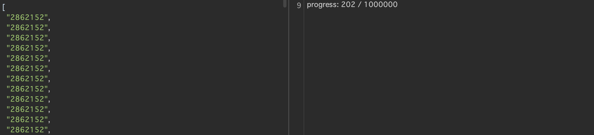

2024年のWaniCTFに参加しました。そこで解いて面白かった問題のWriteupを書きました。

---

## はじめに

🐊

こんにちは、IKです。

自分が学んだことを文書として記録しておこうと考え、記述します。

今回は2024年6月8日にWaniCTFに参加したため、そこで解いて面白かった問題のWriteupを書いてみようと思います。

今回は自分向けの備忘録として簡易的に書こうと思います。

結果は1479チーム中203位でした。

かなり楽しかったですね。

公式 X → [Wani Hackase](https://x.com/wanictf)

---

## beginners_rsa (crypto)

| 問題文 | Do you know RSA ?                     |
| --- | ------------------------------------- |

- chall.py
```python
from Crypto.Util.number import *

p = getPrime(64)
q = getPrime(64)
r = getPrime(64)
s = getPrime(64)
a = getPrime(64)
n = p*q*r*s*a
e = 0x10001

FLAG = b'FLAG{This_is_a_fake_flag}'
m = bytes_to_long(FLAG)
enc = pow(m, e, n)
print(f'n = {n}')
print(f'e = {e}')
print(f'enc = {enc}')
```

- output.txt（長過ぎる数値は省略しています）
```
n = 317903423385943473062528814030345176720578295695512495346444822768171649361480819163749494400347
e = 65537
enc = 127075137729897107295787718796341877071536678034322988535029776806418266591167534816788125330265
```

n の素因数が5つありますね。

基本的に2つと考えていたので、少し戸惑いましたが解法的には同じですかね。

n を素因数分解して5つの素因数の最小公倍数求め、秘密鍵を求めれば解けそうですね。

- get_flag.py
```python

import sympy
import math
from Crypto.Util.number import long_to_bytes

n = 317903423385943473062528814030345176720578295695512495346444822768171649361480819163749494400347
e = 65537
enc = 127075137729897107295787718796341877071536678034322988535029776806418266591167534816788125330265

# 素因数分解
# factors = sympy.factorint(n)
# print("Factors:", factors)

p = 12109985960354612149
q = 13079524394617385153
r = 11771834931016130837
s = 9953162929836910171
a = 17129880600534041513

# 5つの数値の最小公倍数を求める関数
def lcm_of_five(a, b, c, d, e):
    lcm_ab = lcm(a, b)
    lcm_abc = lcm(lcm_ab, c)
    lcm_abcd = lcm(lcm_abc, d)
    return lcm(lcm_abcd, e)

# 拡張ユークリッドの互除法
def extended_gcd(a, b):
    if a == 0:
        return b, 0, 1
    else:
        gcd, x, y = extended_gcd(b % a, a)
        return (gcd, y - (b // a) * x, x)

d = extended_gcd(e,lcm_of_five(p-1,q-1,r-1,s-1,a-1))[1]
m = pow(enc,d,n)

bytes_data = long_to_bytes(m)

print(bytes_data)
```

Flagを得ることができました。

---

## beginners_aes (crypto)

| 問題文 | AES is one of the most important encryption methods in our daily lives. |
| --- | ----------------------------------------------------------------------- |

- chall.py（CTF中に加えたコメント付き）
```python
# https://pycryptodome.readthedocs.io/en/latest/src/cipher/aes.html
from Crypto.Util.Padding import pad
from Crypto.Cipher import AES
from os import urandom
import hashlib

# 暗号鍵
key = b'the_enc_key_is_'
# 初期ベクトル
iv = b'my_great_iv_is_'

# 1バイトのパディングを付与
key += urandom(1)
iv += urandom(1)

# 暗号化オブジェクトを生成
cipher = AES.new(key, AES.MODE_CBC, iv)
# Flagを指定
FLAG = b'FLAG{This_is_a_dummy_flag}'
# Flagをsha256でハッシュ化
flag_hash = hashlib.sha256(FLAG).hexdigest()

# ロックサイズ（ここでは16バイト）に合わせてフラグをパディング（埋め草）する
# AES暗号化では入力データの長さがブロックサイズの倍数である必要がある
msg = pad(FLAG, 16)
# パディングされたフラグを暗号化
enc = cipher.encrypt(msg)


# 出力
print(f'enc = {enc}') # bytes object
print(f'flag_hash = {flag_hash}') # str object
```

- output.txt
```
enc = b'\x16\x97,\xa7\xfb_\xf3\x15.\x87jKRaF&"\xb6\xc4x\xf4.K\xd77j\xe5MLI_y\xd96\xf1$\xc5\xa3\x03\x990Q^\xc0\x17M2\x18'
flag_hash = 6a96111d69e015a07e96dcd141d31e7fc81c4420dbbef75aef5201809093210e
```

AES系の問題ですね。

暗号文とFlagのハッシュ値を与えられています。

keyと初期ベクトルに付与するパディングが各1バイトしかないので、256 * 256 で 65536通りしかないのですべて試せば復号できそうですね。

- get_flag.py
```python
# https://pycryptodome.readthedocs.io/en/latest/src/cipher/aes.html
from Crypto.Util.Padding import pad
from Crypto.Cipher import AES
from os import urandom
import hashlib


# 暗号文
enc = b'\x16\x97,\xa7\xfb_\xf3\x15.\x87jKRaF&"\xb6\xc4x\xf4.K\xd77j\xe5MLI_y\xd96\xf1$\xc5\xa3\x03\x990Q^\xc0\x17M2\x18'
ans_flag_hash = '6a96111d69e015a07e96dcd141d31e7fc81c4420dbbef75aef5201809093210e'
flag = True
byte_chars = [bytes([i]) for i in range(256)]

for i in byte_chars:
    for k in byte_chars:
        # 初期化
        key = b'the_enc_key_is_'
        iv = b'my_great_iv_is_'
        key += i
        iv += k
        # 暗号化オブジェクト生成
        cipher = AES.new(key, AES.MODE_CBC, iv)
        # 復号
        plaintext = cipher.decrypt(enc)
        if plaintext[0:4] == b'FLAG':
	        # ハッシュ化
            decrypto_flag_hash = hashlib.sha256(plaintext[:32]).hexdigest()
            if ans_flag_hash == decrypto_flag_hash:
                print(plaintext)
                break
```

Flagを得ることができました。

---

## Bad_Worker (Web)

| 問題文 | オフラインで動くウェブアプリをつくりました。                |
| --- | ------------------------------------- |

オフラインで動くということで、Flag取得の判定とかもクライアント側で行っているということかなと予測。

実際のコードを見てみると、やはりそのようです。

- service-worker.js
```js
async function onFetch(event) {
    let cachedResponse = null;
    if (event.request.method === 'GET') {
      const shouldServeIndexHtml = event.request.mode === 'navigate';
      let request = event.request;
      if (request.url.toString().includes("FLAG.txt")) {
            request = "DUMMY.txt";
      }
      if (shouldServeIndexHtml) {
        request = "index.html"
      }
        return  fetch(request);
    }

    return cachedResponse || fetch(event.request);
}
```

- 改ざん後
```js
async function onFetch(event) {
    let cachedResponse = null;
    if (event.request.method === 'GET') {
      const shouldServeIndexHtml = event.request.mode === 'navigate';
      let request = event.request;
      // ここを改ざん
      if (request.url.toString().includes("FLAG.txt")) {
            request = "FLAG.txt";
      }
      if (shouldServeIndexHtml) {
        request = "index.html"
      }
        return  fetch(request);
    }

    return cachedResponse || fetch(event.request);
}
```

Flagを得ることができました。

---

## pow (Web)

| 問題文 | ハッシュを計算してフラグを取ろう                  |
| --- | --------------------------------- |

Proof of work とはデジタル決済システムでの二重払いを防止するための仕組みらしいですね。

`Server response: progress: 0 / 1000000`が満たされるとFlagが得られると予測。

BurpSuiteを使って色々試したところ、特定の数値を送信すると、進捗が進むということがわかりました。

しかも、同じ値を何回送っても進捗が進むということもわかりました。

ということで、下記のような感じで送信するJSON内の値を作成しました。

- データ生成
```python
send = ""
temp = "\"2862152\","
for i in range(80000):
    send += temp
print(send)
```

そしてこれをHTTPリクエストのBody欄に入力して、<br>`Server response: progress: 0 / 1000000`を満たすまで送信することでFlagを得ることができました。

余談ですが、最初1,000,000件を一気に送信しようとしていましたが、BurpSuiteのエラーなのか、サーバ側のエラーなのかわかりませんが、失敗しました。

筆者の環境だと80,000件ぐらいがエラーが出ないラインでしたのでそれを何回も送りました。

こんな感じ。



---

## Surveillance_of_sus (Forensics)

| 問題文 | 悪意ある人物が操作しているのか、あるPCが不審な動きをしています。<br>そのPCから何かのキャッシュファイルを取り出すことに成功したらしいので、<br>調べてみてください！ |
| --- | --------------------------------------------------------------------------------------- |

`Cache_chal.bin`というバイナリファイルが一つ与えられました。

バイナリを見てみると、`RDP8bmp`という形式のバイナリファイルということがわかりました。

ここで色々調べた結果、下記のサイトを見つけました。

[RDPビットマップキャッシュについて](https://jpn.nec.com/cybersecurity/blog/231006/index.html)

[bmc-tools](https://github.com/ANSSI-FR/bmc-tools)というツールを見つけたため、早速ダウンロードして使ってみました。

```python
python bmc-tools.py -s "Cache_chal.bin" -d ./output/ -b
```
`
`-b` オプションを付けることで全ビットマップ画像を集約したビットマップ画像を生成することができます。


Flagを得ることができました。

---

## I_wanna_be_a_streamer (Forensics)

| 問題文 | 母ちゃんごめん、俺配信者として生きていくよ。<br>たまには配信に遊び来てな。<br>(動画のエンコーディングにはH.264が使われています。) |
| --- | ------------------------------------------------------------------------ |

開いてみると`file.pcap`というpcapファイルが入っていました。

中身を見てみると、問題文にある通りRTPパケットが流れているログを見ることができました。

RTPとは、TCP/IP上で音声や動画などのデータストリームをリアルタイムに配送するためのデータ通信プロトコルです。[Wikipedia](https://ja.wikipedia.org/wiki/Real-time_Transport_Protocol)

あとは、このRTPパケットから動画を復元することができればFlagを得ることができそうですね。

色々調べた結果、下記のサイトを見つけました。

[GStreamer で Wireshark の RTP パケットからビデオを再生する方法](https://community.cisco.com/t5/tkb-%E3%82%B3%E3%83%A9%E3%83%9C%E3%83%AC%E3%83%BC%E3%82%B7%E3%83%A7%E3%83%B3-%E3%83%89%E3%82%AD%E3%83%A5%E3%83%A1%E3%83%B3%E3%83%88/gstreamer-%E3%81%A7-wireshark-%E3%81%AE-rtp-%E3%83%91%E3%82%B1%E3%83%83%E3%83%88%E3%81%8B%E3%82%89%E3%83%93%E3%83%87%E3%82%AA%E3%82%92%E5%86%8D%E7%94%9F%E3%81%99%E3%82%8B%E6%96%B9%E6%B3%95/ta-p/3162522)

[Gstreamer](https://gstreamer.freedesktop.org/download/#windows)というソフトが使えるみたいですね。

実際ダウンロードして実行してみました。

- 実際のコマンド
```
C:\gstreamer\1.0\x86_64\bin\gst-launch-1.0 -m -v filesrc location=file.pcap ! pcapparse src-port=22000 dst-port=59974 ! application/x-rtp,media=video,clock-rate=90000,payload=96application/x-rtp,media=video,clock-rate=90000,payload=96 ! rtpjitterbuffer ! rtph264depay ! avdec_h264 ! videoscale ! video/x-raw, width=1280, height=720 ! videoconvert ! x264enc ! mp4mux ! filesink location=flag.mp4
```

Thank you for watching ! ということで、

Flagを得ることができました。

---

## 終わりに

WaniCTF 2024 のwriteupを書きました。

今までのチームで参加したCTFの中で一番善戦した気がします。

ハイライトは「I_wanna_be_a_streamer」で動画を出力できたところですね。

WaniCTFを開催、運営、作問してくださったWaniHackaseの皆様ありがとうございました。

最後までお読みいただきありがとうございました。


---